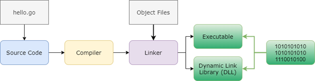
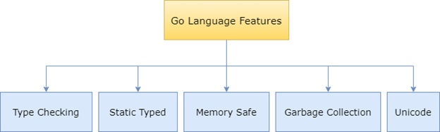
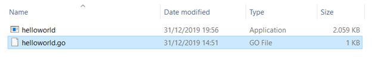
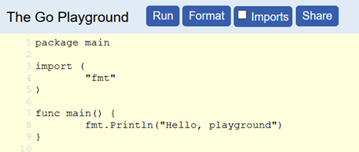
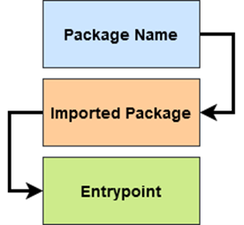
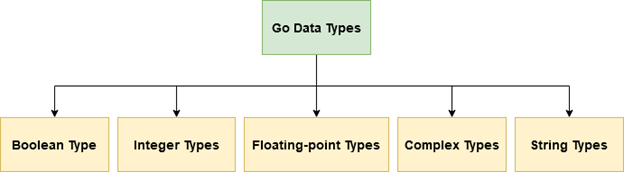

# The Go language Course

Learning Path to Go Language Programming | With Gun Gun Febrianza


# Table of Contents


- Go Language
  - Go is Compiled Language
    - Static Linking
    - Go Compiler
  - Go is Safe Language
    - Type Checking
    - Static Typed
    - Memory Safe
    - Garbage Collection
    - Unicode
  - Go is Multicore Programming
- Setup Go Lang
  - Configure Go PATH
  - Go Compilation
  - Go Execution
  - Go Documentation
  - Go Playground
- Go Program
  - Basic Structure
    - Package Name
    - Imported Package 
    - Entry point
  - Comment
  - Expression & Operator
    - Statement
    - Expression
    - Operator Precedence
    - Block of Code
    - Operator & Operand
    - Arithmetic Operator
    - Arithmetic Operation
    - Comparison Operator
    - Logical Operator
    - Assignment Operator
  - String Literal
  - Rune Literal
  - Numbers Literal
  - Boolean Literal
  - Import Package
  - Variable Declaration
    - Variable
    - Binding
    - Reserved Words
    - Naming Convention
    - Case Sensitivity
    - Var Keyword
    - Zero Value
    - Short-Variable Declaration
    - Multiple-Variable Declaration
- Data Types
  - What is Data?
  - What is Types?
  - What is Data Types?
    - Uint8 Case Study
      - Characteristic
      - Range Value
      - Types
      - Example Code
    - Int8 Case Study
      - Characteristic
      - Range Value
      - Types
      - Example Code
  - What is Strongly Typed Language?
  - What is Dynamically Typed Language?
  - Go Data Types
    - Numeric Data Types
    - 32 Bit & 64 Bit Processor
    - Signed Integer
    - Unsigned Integer
    - Implementation Specific Type
    - Architecture-dependent Type


---


# Go Language

Go or Golang is an open source programming language created by Robert Griesemer, Rob Pike and Ken Thompson in 2007 at Google. Robert Griesemer is a Google employee with a deep understanding of Code Generation for the Google V8 Javascript Engine. Ken Thompson is a poet who created the UNIX operating system.

Rob Pike worked with Ken Thompson to develop the UTF-8 encoding scheme. The Go programming language was designed by the best pioneers & innovators in the world of computer science.

It all started in 2007, when Google's Search Engine software crashed. There are millions of lines of code to maintain, every time they add a new feature and test the feature the compilation process has to be done. The compilation process can take hours, which is very bad for developer productivity.

This reason is what inspired them to create programming languages that can be written quickly, compiled quickly and executed quickly. Go lang is the answer to all the problems they face.

*“A language that was fast to write code for and produced programs that were fast to compile and run.”*

In 2009, the Go programming language was made open source so that it could be developed by developers from all over the world.


---


## Go is Compiled Language

Go is a high-level programming language that needs to be compiled in order to be understood by machines.

Go is a Compiled Language, meaning Go is a programming language that uses a compiler to perform compilation. Go source code must first be translated into an executable format. Go will produce executable files that can run on windows, linux and mac operating systems.




---


### Static Linking

Compilation is a process for translating human-readable source code into binary code, a series of instructions that are understood by computers. If you forgot or haven't read it you can read the first chapter 1 about compilers.

The compilation process in the Go programming language will produce binary code in executable format. Executable files are self-contained and can be executed directly without requiring dependencies on certain libraries. Go uses Static Linking so that the generated binary files can be easily transferred to other operating systems.

Once programs built with Go are compiled, developers don't have to worry about libraries and dependencies anymore.

When compilation occurs the compiler can check for errors, perform optimization and produce binary code according to the intended target platform. We can produce executables to run on Windows, Linux and MacOS operating systems.

The Go programming language also supports jargon:

*“write your code once and run it anywhere”*


---


### Go Compiler

Most compilers for the Go programming language are written in the Go programming language itself. 

The name of the compiler program for the Go programming language is gc or Go Compiler.
The program has been inserted into the Go SDK (Software Development Kit).


---


## Go is Safe Language




### Type Checking

Every time we create a variable we must first determine the data type to be used. This protects developers from a bunch of common bugs and security flaws in the code we write.


---


### Static Typed

Go is a programming language that has the characteristics of statically typed, means a variable created with a certain data type cannot be used on other data types. Look at the code below:

```go
var int data;
data = 50;
data = “Hello World!”; // compilation error
```

The advantage of static typing is that the compilation results produce code that can be executed quickly, because the compiler knows what data types are used so that it is able to produce optimized machine code.

Optimization provides added value such as speed and lighter memory usage in the application software produced.


---


### Memory Safe

Go ensures memory safety so that the programs we write can avoid bugs and security vulnerabilities, when the programs we write interact with memory access.

All of this is possible because Go has a check bound access feature that prevents incorrect memory access.

Programs can only have access to authorized memory locations. Protect developers from security flaws so that software development becomes more secure.


---


### Garbage Collection 

Go is a programming language that supports Automatic Memory Management so we don't have to think about memory allocation and deallocation problems. Garbage Collection is a feature that ensures that unused references that are no longer in use are deleted and cleaned in memory.


---


### Unicode

Go is a programming language that supports Unicode so that it can print all human language systems around the world.

In programming languages that support dynamically typed languages such as javascript, python, php and ruby, they argue that development productivity will increase if we don't have to worry and focus on types and memory.

However, there are trade-offs in these advantages, namely the downside in terms of performance, memory efficiency and bugs around type-mismatch.

Go declares itself to be able to provide the same productivity as a programming language that supports dynamically typed languages, but does not sell in terms of performance and efficiency.


---


## Go is Multicore Programming

There is an interesting fact, all the current popular programming languages are not designed to be able to take advantage of multiple CPU Cores (Multicore).

The Go programming language has been designed by legends like Robert, Rob and Ken so that we can write parallel and concurrent code safely. So that we can take advantage of modern multicore CPUs and Cloud Computing.

The transformation of computer performance continues to change, with the current status quo of the computer world. Today discuss about speed means how we can take advantage of the concept of parallel or concurrency. How come?

Below is the author's opinion, there are several factors why multi-core programming will bring programming standards and trends in the future:

1. According to Moore's Law, every 18 months the total transistors in the Central Processing Unit (CPU) doubles. The Central Processing Unit (CPU) is able to accommodate more transistors and their size is getting smaller.
2. Every 18 months the speed of the Central Processing Unit (CPU) continues to double, starting from 1950.
3. However, after more than 50 years, in 2002 there was a limitation in the circuit design of the Central Processing Unit (CPU), demanding a new architecture.
4. The solution to the problem above is a multi-core processor, after 2002 in one chip there can be 2 cores, 4 cores, 8 cores more processors.
5. However, each core does not experience an increase in speed, only the number of cores increases. Moore's law is still running, no longer by adding transistors in the Central Processing Unit (CPU) but adding cores in a single chip.
6. Chip manufacturers are starting to stop adding transistors, the trend is starting to focus on adding cores and caches. However, increasing the number of cores is also limited by economic costs.
7. Increasing the amount of cache will also eventually find a limit, the bigger the cache, the slower it gets.
8. From the problems above, it is clear that we can no longer rely on hardware improvement innovations but how to build efficient software development.
9. Based on the current status quo of the chip industry, software engineers must utilize multicore processors with the concept of concurrency to maximize hardware capabilities.


---


# Setup Go Lang

Before we start the practice of writing code using the Go language, we must first understand what GOPATH is. The GOPATH configuration needs to be made first so that we have a Workspace.

Go Workspace is where Go manages source files, compiled binaries and cached objects for faster compilation.


## Go Compilation

It has become a tradition that if we are acquainted with a programming language we will make the simplest program, namely Hello World.

We will learn to compile a Go program to display the hello world message, to start it in the src folder create a folder called 1.Intro. Then create a file called helloworld.go, then write the code below:

```go
package main

import (
    "fmt"
)

func main() {
    fmt.Println("Hello World!")
}
```

To compile, please execute the command below:

```bash
 $ go build helloworld.go
```

If successful then in the same directory will appear a binary file named helloworld.exe

To get more detailed information, execute the command below:

```bash
$ file helloworld
helloworld: PE32+ executable (console) x86-64 (stripped to external PDB), for MS Windows
```

Next we can execute the executable file that has been created:

```bash
$ helloworld
Hello World!
```

If we look, the size of the executable becomes larger. This is because the executable already supports statically linked characteristics, which means that it does not require external libraries to run.




---


## Go Execution

Apart from compiling there are other ways to execute programs written in Go without having to produce executables. To do this, execute the command below:

```bash
$ go run helloworld.go
Hello World!
```


---


## Go Documentation

Go provides a program called go doc to make it easier for us to get a documentation without having to connect to the internet.

For example, if we want to display information about the Printf() function from the fmt package, execute the command below:

```bash
$ go doc fmt Printf
```


---


## Go Playground

Apart from writing code using our preferred Editor, Go also provides an online version of the editor to test the golang code that we write in:

https://play.golang.org/




----


# Go Program

*The goals of the Go project were to eliminate*  *the slowness and clumsiness of software development* *at Google.*


## Basic Structure

Below is the most basic structure of the Go program, there are 3 main components namely Package Name, Imported Package and Entry point:



```go
package main

import (
    "fmt"
)

//entrypoint
func main() {
    fmt.Println("Hello World!")
}
```


### Package Name

Every program written using Go must have a package keyword. The entire code above is part of the main package. We use a special package called main, a package that is required for the program to run when executed.


---


### Imported Package

Next there is a statement that contains the import keyword, this keyword is used when we want to use a built-in package that has been provided by Go.

In the source code above we use the fmt package.

The usefulness of the fmt package is that we can interact with input and output, in the source code above we use the Println function of the fmt package to display text in standard output.


---


### Entry Point

In the next code above we have the **main() function** which acts as an entry point where the code will be read for the first time when the program is executed.


---


# Data Types

*Without data, you're just another person with an opinion.*

*— W. Edward Deming* 


To understand the concept of Data Types in Go, there are some fundamental concepts that we must learn in an organized and systematic way.


## What is Data?

In computing we need to reading, changing, and writing data. **Data** is any information that can be moved, processed, or stored by a computer. Data in computers is represented in the form of **Binary Digits** (bits), the smallest unit of information in a computer machine. 

Each bit can store one value of the **binary number**, i.e. 0 or 1, a set of bits forms could construct Digital Data. If there are 8 bits collected it will form a **Binary Term** or **Byte**.

At the byte level, it has formed a unit of storage that can store a single character. One byte of data can store 1 character for example: 'A' or 'x' or '$'.

A series of bytes are used to create Binary Files, in binary files there is a series of bytes that are created to represent more than just characters or text. At higher levels (kilobytes, megabytes, gigabytes & terabytes) these bits can be used to represent text, images, sound and video.

Data in the context of programming is a set of bits that represent information.


---


## What is Types?

A **data type** more commonly just called a **type** tells the compiler what type of value that will be stored to variable. Types are a set of values recognized by the compiler or interpreter to specify how the data should be used. A type tells the program how to interpret a value in memory.

All data on a computer is represented as sequence of bits, we use a **data type** to tell the compiler how to interpret the contents of memory in some meaningful way. 

A types specifies:

1. What kind of data can be stored?
2. How much memory is needed to store data?
3. What operations are performed on the data?


---


## What is Data Types ?

Data Types is a set that has:
1. Characteristic
Name of the keyword and the size of the memory it uses to store data.
2. Range Value
Range Value is the range of value variations that can be stored.
3. Type
Refers to numeric or symbolic.

All data types are made up from a set of units of memory called bytes. We will take a case study of data types in the Golang programming language, in this case uint8 and int8 :


### Uint8 Case Study


#### Characteristic 

For example, there is a data type with the following characteristics:
1. Named uint8 (uint = unsigned integer)
2. The memory size is 1 byte or 8 bits.

The term unsigned integer means that we can only store positive integer data, we cannot store negative integer data.

#### Range Value 

So in the uint8 data type we can accommodate a set of integers with a range value of:

**Table uint range value**

| Minimum | Maximum |
| ------- | ------- |
| 0       | 255     |

How come the uint8 data type can store values with a distance between a minimum of 0 and a maximum of 255?

Based on the memory size characteristics of uint8 we know that its size is 1 byte, in the previous chapter on the Data Hierarchy we already know that a byte is a representation of 8-bits. It means that the range of values that can be reached is 2^8, which is 256 and can only be filled with non-negative values.

**Table uint memory**

| byte | bits |
| ---- | ---- |
| 1    | 8    |

Why is the maximum integer value that can be stored is 255 not 256?

Became 255 because the calculation (numeration) in the computer starts from zero not from the number 1, so the maximum value becomes 255. That way the equation to calculate the maximum integer value that can be stored is 2^8-1 = 255.

#### Types 

In the uint8 data type, the type used is numeric so that we can perform numerical computations.

#### Example Code

```go
package main

import "fmt"

func main() {
    var maxUint8 uint8 = 255
    fmt.Println(maxUint8) // Output : 255

    /*  var anothermaxUint8 uint8 = 255 + 1
    fmt.Println(anothermaxUint8)  */
    // Output : constant 255 overflows uint32
}
```


---


### int8 Case Study


#### Characteristic 

For example, there is a data type with the following characteristics:
1. Named int8 and
2. The memory size is 1 bytes.
Previously we know that unsigned integer can only store positive integer data, in signed integer we can store positive integer and negative integer data.

#### Range Value 

So in the int8 data type we can accommodate a set of integers with a range value of:

**Table int range value**

| Minimum | Maximum |
| ------- | ------- |
| -128    | 127     |

How come the int8 data type can store values with a distance between a minimum of -128 (negative) and a maximum of 127 (positive)?

Because int8 supports both positive and negative values, 1 bit is used as a negative or positive sign for an integer.

So from 8 bits remaining 7 bits, meaning that the binary data pattern that can be created is 2^7, namely 128. This is the factor why the minimum range value of int8 is -128 and the maximum value that can be achieved is 127 because 0 is also calculated in the numeration.

**Table int memory**

| **Bytes** | **Storage** | **Sign** |
| --------- | ----------- | -------- |
| 1         | 7 bit       | 1 bit    |

#### Types

In the int8 data type, the type used is numeric so that we can perform numerical computations.

#### Example Code

```go
package main

import "fmt"

func main() {
    var maxInt8 int8 = 127
    fmt.Println(maxInt8) // Output : 127

    /*  var anothermaxInt8 int8 = 127 + 1
    fmt.Println(anothermaxInt8)  */
    // Output : constant 128 overflows int8
}

```


---


## What is Strongly Typed Language?

Go is Statically Typed Language or Static Typing meaning that the value in a variable must have a data type. A programming language is said to be Strongly Typed if a compiler will produce an error if a type is used in the wrong way. 

Strongly Typed offer correctness and safety. The correctness value provides advantages in terms of performance. The safety value provides better data integrity management, better detection of bugs and possible errors at runtime.


---


## What is Dynamically Typed Language?

If you have previously studied programming languages such as python and javascript, then you will understand Loosely Typed Language or Dynamic Typing. You can create variables without having to set a data type first, whether it's a literal number, string or Boolean logic.

A language is said to be Dynamically Typed because at runtime, data types can be changed to other data types so that programs can run according to instructions.

Dynamically Typed offer simplicity and speed for software development. In Dynamically Typed software development can be faster, less rigid, easier to make changes.


---


## Go Data Types



In the Go programming language there are 17 Built-in Types that have been provided, including:

1. **Boolean Type** is like **bool**.
2. **Integer Numeric Types** such as **int8**, **uint8**, **int16**, **uint16**, **int32**, **uint32**, **int64**, **uint64**, **int**, **uint**, and **uintptr**.
3. **Floating-point Numeric Types such as float32 and float64.**
4. **Complex Numeric Types** such as **complex64** and **complex128**.
5. **String Type** is like a **string**.

If we look in detail 15 of the 17 built-in types are numeric types, such as integer types, floating-point types and complex types. 

In addition, the Go programming language also supports built-in aliases, including:

1. **byte** is an alias of **uint8**.
2. **rune** is an alias of **int32**.


---


### Numeric Data Types

The maximum number that can be used in a computer depends on the processor architecture that we use.


---


### 32 Bit & 64 Bit Processor 

The word 32 and 64 Bit refers to the architecture of the processor, 32 and 64 bit to distinguish the processor's ability to access memory through the CPU Register. At 32 bit the ability to access the memory address reaches 2^32.

At 64 bits the ability to access memory addresses reaches 2^64.

On a 32-bit processor the processing ability to interact with RAM is limited to 4 GB, while on a 64-bit processor the processing ability to interact with RAM can be more than 4GB.

The 64-bit processor can process data more than a 32-bit processor. On a 64-bit processor, the value of computing is superior, including the memory address it has.

In addition, a significant differentiating factor between 32-bit processors and 64-bit processors is the ability to calculate per second which affects the speed to complete a job.

---


### Signed Integer 

In Signed Integer we can store negative integer values and positive integers. Signed Integer uses 1 bit to represent a sign (positive or negative).

| **No** | **Types** | **Description**           | **Range**                                                    |
| ------ | --------- | ------------------------- | ------------------------------------------------------------ |
| 1      | int8      | *Signed 8-bit  integers*  | (-128 to 127)                                                |
| 2      | int16     | *Signed 16-bit  integers* | (-32768 to 32767)                                            |
| 3      | int32     | *Signed 32-bit  integers* | (-2147483648 to 2147483647)                                  |
| 4      | int64     | *Signed 64-bit  integers* | *Signed 64-bit integers :*  (-9223372036854775808  to 9223372036854775807) |
| 5      | int       | *Platform Dependent*      | *Platform Dependent*                                         |

The term Platform Dependent means that it can be Signed 32 bit integer in 32 bit computer machine architecture and Signed 64 bit integer in 64 bit computer machine architecture.

You will understand more about the meaning of platform dependent on the next page about Architecture-independent Type & Implementation Specific Type.

Below is an example of Signed Integer in Go language :

```go
func main() {
    var SignedInteger8 int8 = 127
    fmt.Println(SignedInteger8) // Output : 127

    var SignedInteger16 int16 = 32767
    fmt.Println(SignedInteger16) // Ouput : 32767

    var SignedInteger32 int32 = 2147483647
    fmt.Println(SignedInteger32) // Ouput : 2147483647

    var SignedInteger64 int64 = 9223372036854775807
    fmt.Println(SignedInteger64) // Ouput : 9223372036854775807

    // fmt.Println(SignedInteger32 + SignedInteger64)
    // invalid operation: SignedInteger32 + SignedInteger64 (mismatched types int32 and int64)
}
```


---


### Unsigned Integer

Unsigned Integer can only store positive integers.

| **No** | **Types** | **Description**             | **Range**                   |
| ------ | --------- | --------------------------- | --------------------------- |
| 1      | uInt8     | *Unsigned 8-bit  integers*  | (0 to 255)                  |
| 2      | uInt16    | *Unsigned 16-bit  integers* | (0 to 65535)                |
| 3      | uInt32    | *Unsigned 32-bit  integers* | (0 to 4294967295)           |
| 4      | uInt64    | *Unsigned 64-bit  integers* | (0 to 18446744073709551615) |
| 5      | uint      | *Platform Dependent*        | *Platform Dependent*        |

Below is an example of Unsigned Integer in Go language :

```go
func main() {
    var unsignedInteger8 uint8 = 255
    fmt.Println(unsignedInteger8) // Output : 255

    var unsignedInteger16 uint16 = 65535
    fmt.Println(unsignedInteger16) // Ouput : 65535

    var unsignedInteger32 uint32 = 4294967295
    fmt.Println(unsignedInteger32) // Ouput : 4294967295

    var unsignedInteger64 uint64 = 18446744073709551615
    fmt.Println(unsignedInteger64) // Ouput : 18446744073709551615

    // fmt.Println(unsignedInteger16 + unsignedInteger8)
    // invalid operation: unsignedInteger16 + unsignedInteger8 (mismatched types uint16 and uint8)
}
```

Arithmetic operations between numbers with different data types cannot be performed.

There are 2 numeric types in the Go language programming language:

1. Implementation Specific Type
2. Architecture-dependent Type


---


### Implementation Specific Type

The use of int and uint is highly recommended because there are different computer machine architectures (32 & 64 bit).

The use of int and uint keywords will help the compiler to produce code according to the target computer machine architecture. This process is called Implementation Specific Type.

If we make a Go program with the data type int then when compiled with the target architecture 32 bit the size of the data type is also 32 bit, so if we compile on a 64 bit architecture the variable size remains 64 bit.


---


### Architecture-dependent Type

In the Architecture-independent type, the data bit size does not change even though the program is executed on any computer machine.

Most of today's computer machine architecture has reached 32 bit and 64 bit. If we write a program and it has an int32 data type, its size will remain constant when we execute it on a 64 bit computer machine architecture.


---

